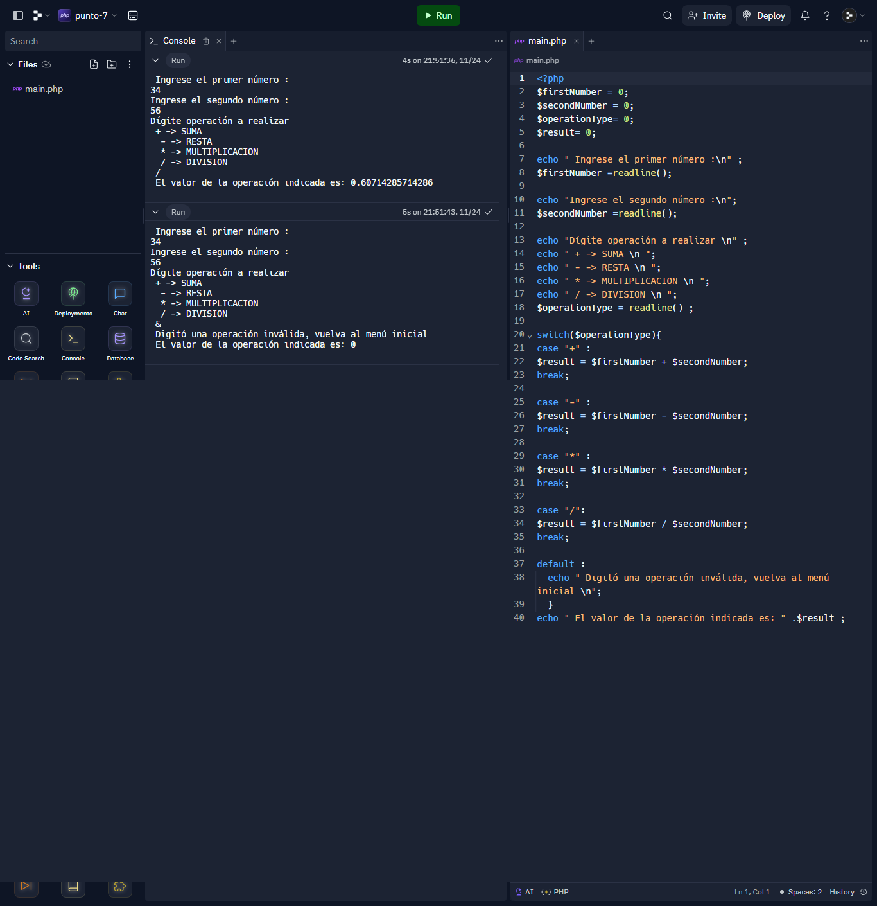
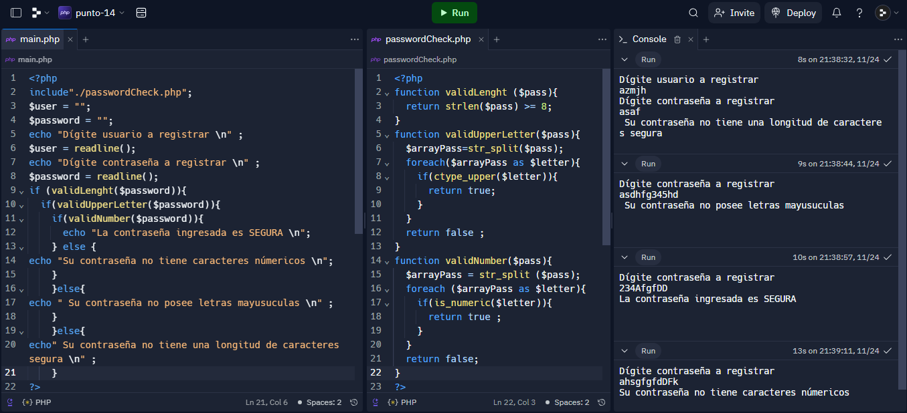

<h1>Taller 10 - Andrey Felipe Mahecha Gómez</h1>

<h2>Información</h2>

<b>Curso :</b> Full Stack Básico - Grupo 1

<b>Profesor: </b>Cristian Patiño

<h2>Punto 1 : Constantes y Variables</h2>

<h2>Punto 2 : Sumas de Constantes y Variables</h2>

<h2>Punto 3 : Suma de dos números dados  por el usuario</h2>

<h2>Punto 4 : Datos usuarios en consola</h2>

<h2>Punto 5 : Entrada bolera usando If/ elseif</h2>
Punto 6 : Detección mayoría de Edad</h2>
Punto 7 : Selección de Operación Aritmética</h2>
Punto 8 : Entrada bolera usando Switch</h2>
Punto 9 : Tabla de Multiplicar usando While</h2>
Punto 10 : Número Pares usando While</h2>
Punto 11 : Números Impares usando For</h2>
Punto 12 : Tabla de Multiplicar usando For</h2>
Punto 13 : Suma de Valores de un arreglo usando ForEach</h2>
Punto 14 : Revisión de Contraseña</h2>
Punto 15 : Selección de Operación aritmética usando funciones</h2>
<img src="./public/images/punto-15.png" alt="Punto 15"